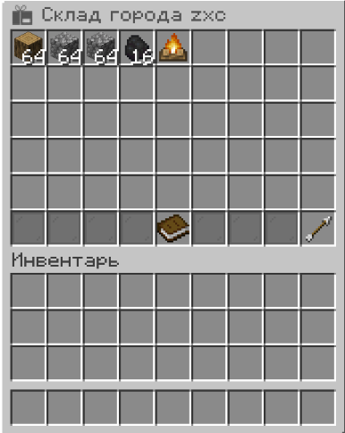
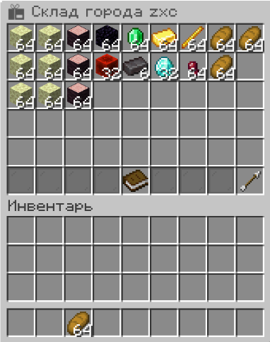

# Уровни города

Уровень — главный показатель развития. Он открывает здания, резко расширяет территорию
и даёт доступ к идеологии и религии.

```
/t levelup
```

Команда показывает, чего не хватает, и повышает уровень, когда всё готово.
Повышает **только мэр**.

!!! success "Качается только за деньги и ресурсы"
    Жители, построенные здания, приваченные чанки и возраст города **больше не проверяются**.
    Нужны монеты в банке и материалы — всё. Хотите — качайтесь вдвоём, хотите — всем городом.

---

## Что требуется

**Тратится:** деньги из банка города и ресурсы. Больше ничего.

!!! info "Откуда берутся ресурсы"
    **Основание города** — только из **инвентаря основателя**: города ещё нет, склада тоже.
    **Повышение уровня** — со **склада города** (`/t inv`) и из **инвентаря мэра** одновременно.
    Поэтому жители могут просто сдавать материалы на склад.

### Основание города

Стоит **3 монеты** плюс материалы:

| Требование | Сколько |
|---|---|
| Дубовые брёвна | 64 |
| Булыжник | 128 |
| Уголь | 16 |
| Костёр | 1 |



### Уровень 1 → 2

| Требование | Сколько |
|---|---|
| Банк города | 25 монет |
| Каменные кирпичи | 96 |
| Кирпичи | 96 |
| Шерсть | 64 |
| Железные слитки | 64 |
| Уголь | 32 |
| Морковь | 64 |
| Картофель | 64 |


*Первая ступень: лимит территории вырастает вдвое с половиной.*

### Уровень 2 → 3

| Требование | Сколько |
|---|---|
| Банк города | 80 монет |
| Брёвна тёмного дуба | 192 |
| Песчаник | 128 |
| Диорит | 128 |
| Уголь | 64 |
| Алмазы | 16 |
| Гнилая плоть | 64 |
| Нити | 64 |
| Стейки | 64 |
| Тыквы | 64 |


*Открываются [идеологии](ideology.md) и [религии](religion.md).*

### Уровень 3 → 4

| Требование | Сколько |
|---|---|
| Банк города | 200 монет |
| Адские кирпичи | 320 |
| Адский кварц | 128 |
| Незеритовые слитки | 2 |
| Железные слитки | 64 |
| Паучьи глаза | 64 |
| Жемчуг Энда | 8 |
| Адский нарост | 64 |
| Стейки | 64 |
| Слёзы гаста | 2 |


*Дальше без Ада не обойтись — нужен доступ через **Адские врата**.*

### Уровень 4 → 5

| Требование | Сколько |
|---|---|
| Банк города | 450 монет |
| Эндерняк | 384 |
| Вишнёвые брёвна | 192 |
| Обсидиан | 64 |
| Блоки редстоуна | 32 |
| Изумруды | 64 |
| Незеритовые слитки | 6 |
| Золотые слитки | 64 |
| Алмазы | 32 |
| Палки ифрита | 64 |
| Паучьи глаза | 64 |
| Хлеб | 192 |



*Требуется Энд — значит и **Врата Энда**.*

### Уровень 5 → 6

| Требование | Сколько |
|---|---|
| Банк города | 900 монет |
| Обсидиан | 192 |
| Плачущий обсидиан | 16 |
| Пурпурные блоки | 64 |
| Светокамень | 64 |
| Книжные полки | 192 |
| Алмазы | 64 |
| Железные блоки | 32 |
| Незеритовые слитки | 16 |
| Изумруды | 64 |
| Золотые блоки | 32 |
| Звёзды Незера | 3 |
| Палки ифрита | 192 |
| Бамбуковые блоки | 192 |
| Кактусы | 64 |
| Тыквы | 64 |
| Тыквенные пироги | 64 |
| Стейки | 64 |
| Жареная баранина | 64 |
| Жареная курица | 64 |
| Синее стекло | 192 |
| Вишнёвые брёвна | 192 |


*Максимум. Такой город виден на карте особым значком.*

---

## Что даёт уровень

| Уровень | Лимит чанков | Что открывается |
|---|---|---|
| 1 | **60** | базовые здания, работы, склад |
| 2 | **150** | Концлагерь (каторга), склад 2 ур. |
| 3 | **300** | **идеологии, религии**, Ратуша, большинство зданий |
| 4 | **600** | верхние уровни военных зданий |
| 5 | **1000** | элитные здания |
| 6 | **1500** | всё, максимальный значок на карте |

Сверх этого — **+8 чанков за каждого жителя**.

Город 3 уровня на 5 жителей: `300 + 40 = 340` чанков.
Город 6 уровня на 12 жителей: `1500 + 96 = 1596` чанков.

!!! tip "Лимит — это потолок, а не план"
    Приват каждого чанка стоит **1 монету**, и каждый чанк добавляет к ежедневному
    содержанию. Берите столько земли, сколько реально используете.

---

## Как быстрее качаться

**Набирайте людей.** Каждый житель — это +8 чанков сверх лимита, потенциальный заработок
и 10% его зарплаты в банк города. Требования по жителям убраны, но города здесь
всё равно задуманы как коллективная игра.

**Ставьте работы.** `/t jobs` — жители зарабатывают себе и городу одновременно.

**Копите на складе, а не в сундуках.** Ресурсы для повышения берутся со **склада города**
и из инвентаря мэра. Пусть жители сдают материалы на склад — это самый удобный способ
собирать взносы.

**Не забывайте про содержание.** Чем больше чанков, тем дороже город
(`0.5 + 0.01 за чанк в день`). Город на 300 чанков платит 3.5 монеты в день,
на 1500 — 15.5. Убедитесь, что доход это тянет.

---

## Частые вопросы

**Ресурсы пропали, а уровень не поднялся.**
Не бывает: списание происходит только после того, как все условия выполнены.
Если чего-то не хватает — команда просто показывает список.

**Можно ли скинуться всем городом?**
Да и нужно. Ресурсы берутся со склада — пусть жители складывают туда.
Деньги — через `/t deposit`.

**Нужны ли жители и здания для уровня?**
Нет. Раньше проверялись, теперь нет — только деньги и материалы.

**Город стал руинами — уровень сбросится?**
Нет, уровень сохраняется. Но пока город в руинах, повышать его нельзя —
сначала `/t restore`.
